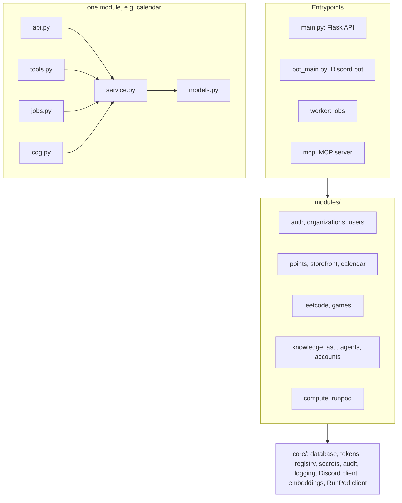
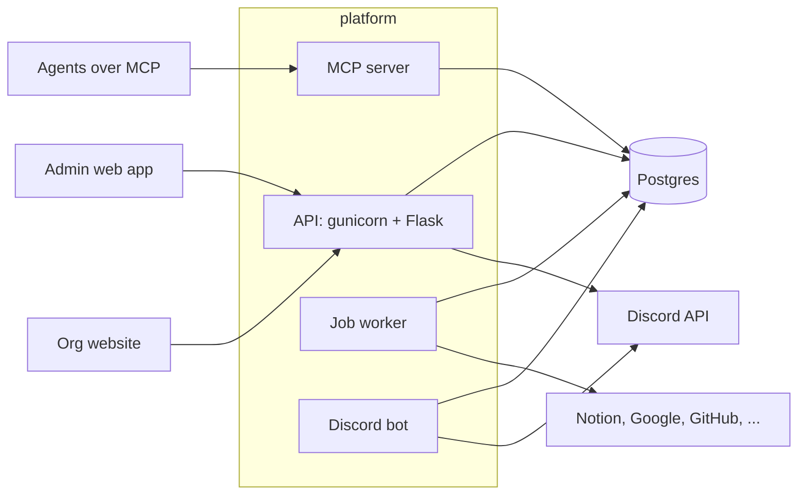
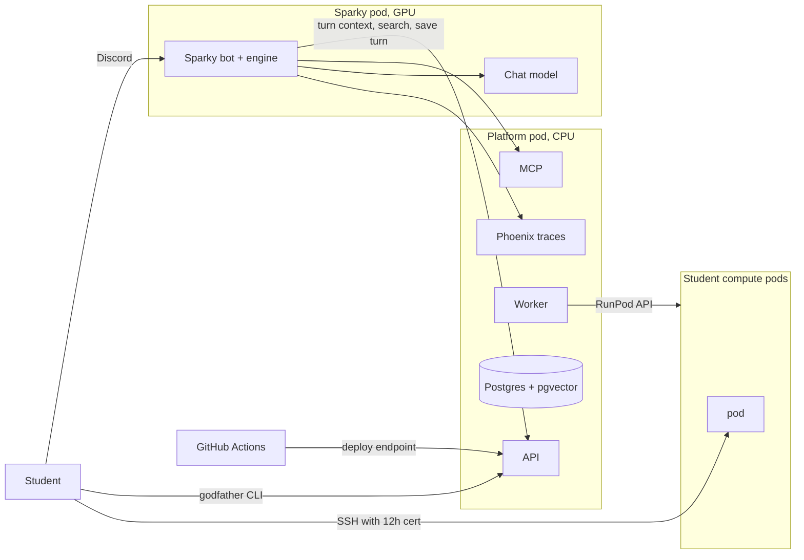

# Roadmap

This is the plan for turning platform into shared infrastructure for SoDA, AIS and other student orgs. It is a copy of the [Platform upgrade plan](https://claude.ai/artifact/WJsW2y9moQP3F9ZzXMzPQg) doc as of 2026-10-07. When the two differ, update this file in the same PR as the change it describes.

## Status

| Phase | State | PRs (theaisocietyasu/bedrock) |
| --- | --- | --- |
| 0. CI/CD and a safety net | Merged | #1 |
| 1. Make multi-org safe | In review, report mode | #2, #3, #4, #5 |
| 2. Run it properly | In review | #6, #7, #9, #10 |
| 3. Modules and jobs | In review | #12 core/ and import rules, #13 module switches, #14 job queue, #15 games and LeetCode split, #16 audit log, #17 org secrets, #18 CLI |
| 4. What AIS adds | In progress | #19 machine tokens and scopes, #20 MCP server and /api/tools, #21 agents, #22 knowledge storage and search, #23 accounts, #24 RunPod app deploys |
| 5. Godfather as the compute module | Not started | |

The phase PRs are stacked: each is based on the previous one, so merge them in order.

Phase 4 still to do: Sparky's ingestion pipeline and ASU sources in the knowledge and asu modules (#22 stores and searches chunks that writers send), the live query endpoint, turn context and turn commit endpoints on agents, embedding profile nodes, reading platform.app.yaml from the app's repo, and the Sparky cutover in its own repo.

Phase 3 leftovers: the LeetCode daily post still runs in the bot (its verify loop keeps state in memory), games and LeetCode have no per-org switch yet (neither is tied to an org), Google credentials are still instance-wide, and the web app does not hide turned-off modules.

## Summary

We upgrade asusoda/platform in place, inside SoDA's repo, into shared infrastructure that AIS, SoDA and other orgs can use. Each org turns on only the modules it wants. The Bedrock scaffold gets archived, and its design ideas move into platform.

The work runs in this order:

1. Fix authorization before a second org is added.
2. Make it run properly: gunicorn, a separate bot process, Postgres.
3. Add per-org module toggles and a real job queue.
4. Add what AIS wants: an MCP server over the database, the scraper as scheduled jobs, an agents module that stores every agent's conversations and memory, and RunPod CI/CD.
5. Move Godfather in as a module.

Platform stays on Flask. A FastAPI rewrite of a live system would block everything else and buys little for this scope.

Sparky and Godfather are adjusted to fit platform, not the other way round. Where either one has its own copy of something platform has or needs (users, login, tokens, jobs, storage, audit), platform's version is kept and the app's copy is deleted.

The earlier [Bedrock V0 plan](https://claude.ai/code/artifact/33c43356-c561-4e5a-ab2f-098db27aae8e) is replaced by this one. ash chose this direction on 2026-10-07. Its RunPod findings still apply.

## What moves where

Everything AIS runs ends up as a platform module or as an app that calls platform. Nothing lives in a third codebase.

| From | What | Goes to in platform |
| --- | --- | --- |
| Bedrock scaffold | Module contract (sources, jobs, tools, panels), visibility rules, dry\_run on write tools, audit log, structured logging, just/CI/GHCR conventions | A small modules/core registry and conventions documented in docs/. Most of Bedrock's code is NotBuiltYet stubs, so this is design, not code. |
| Bedrock modules | github and notion syncs (about 300 lines each), external MCP proxy (178 lines) | Ported as platform modules once the job queue exists |
| Sparky apps/scraper | Fetch, pacing, robots.txt, extraction, chunking, embedding, the ASU sources and live queries, about 5.5k lines of Python | A knowledge module (pipeline, pgvector search) and an asu module (sources). Sparky's engine calls platform over HTTP. |
| Sparky's agent database | users, conversations, messages, memories, profile graph, confirmations, OAuth grants | Sparky's users become platform users. The rest goes to an agents module (conversations, messages, memories, profile graph, pending actions) and an accounts module (OAuth grants), usable by any future agent. |
| Godfather backend | Pods, SSH certificates, file manager, Discord member list; Flask, about 1.9k lines | A compute module. Same framework, so this is mostly moving files and switching Mongo to SQLAlchemy models. |
| Godfather frontend | Next.js admin portal | Pages in platform's web app. The CLI and pod image stay in the godfather repo. |
| Platform today | points, storefront, LeetCode bot, calendar sync, superadmin | Stay. They are turned off per org, so AIS does not see them. |

AIS joins as a second organization in the same deployment, keyed by its Discord server. Platform is already multi-org; the missing piece is enforcing it (phase 1).

[diagram: Target shape · one platform, two clubs, RunPod for GPU\]

Each club turns on its own modules. AIS's instance, Sparky and the student pods run on RunPod. SoDA's instance stays on SoDA's server until the branch merges.

## Codebase and architecture

Three drawings: how the code is laid out, how platform works for any org, and how the AIS instance runs.

### Codebase layout

- Every module folder has the same files, and only the ones it needs: **init**.py (the manifest), models.py, schemas.py, service.py, api.py, tools.py, jobs.py, cog.py for Discord commands, README.md and tests/.
- service.py holds all the logic. Its functions take a database session, the org and the caller as arguments, and never read Flask's request or current\_app. That is what lets one function serve REST, MCP, jobs and the bot.
- api.py, tools.py, jobs.py and cog.py stay thin: validate input with schemas.py, check the caller's scope, call service.py, return the result.
- Code that more than one module uses goes in core/: database, login and tokens, the module registry, settings and secrets, audit, encryption, logging, the Discord client and member cache, embeddings and the RunPod client. Today's modules/utils moves there.
- A module may call another module's service.py, never its models or routes. import-linter checks these rules in CI, along with two more: core imports no module, and only api.py files and the entrypoints import Flask.
- Calendar is the first example. Today its routes reach the logic through current\_app.multi\_org\_calendar\_service (modules/calendar/api.py:72), so only a Flask request can use it. Afterwards one list\_events function serves GET /api/calendar/{org}/events, an MCP tool, the sync job and a bot command, with one set of tests.

### Platform on its own

Any org can run this with docker compose or as one pod. It needs a Discord server for its members and a Postgres database. Everything else is a module it can leave off.

### The AIS instance

1. Chat. A student asks Sparky in Discord. Sparky's engine gets the turn context and searches knowledge on platform, answers with the model on its own pod, and saves the turn back to platform.
2. Compute. A student runs godfather connect with their platform token. Platform checks they are in AIS's Discord server and signs a 12-hour certificate, and the CLI opens SSH straight to the pod.
3. Pods. The compute module creates, stops and expires student pods through the RunPod API. The worker stops idle ones.
4. Deploys. A merge in the platform or Sparky repo runs checks, builds the image and pushes it to GHCR. Sparky's workflow then calls platform's deploy endpoint, and the runpod module points Sparky's pod at the new image. Platform's own workflow updates the platform pod through the RunPod API directly, since a pod should not restart itself.

Knowledge refresh runs in the background: the worker fetches the scheduled ASU pages, chunks and embeds them on the CPU, and writes them to Postgres.

Which modules each org turns on:

| Module | SoDA | AIS at launch |
| --- | --- | --- |
| auth, organizations, users, audit | on | on |
| points, storefront | on | off |
| leetcode, games | on | off |
| calendar | on | off, turned on when AIS wants its Notion to Google Calendar sync |
| knowledge, asu, notion, github | off | on |
| agents, accounts | off | on |
| compute, runpod | off | on |

Turning a module off hides its routes, MCP tools, jobs and bot commands for that org. Its code and tables stay, so turning it on later is a settings change.

## How Sparky and Godfather work afterwards

### Sparky

Sparky becomes a stateless agent: its model, prompts, tools and Discord bot. Everything it stores, and everything that gathers knowledge, moves to platform.

| Stays in Sparky | Moves to platform | Removed from Sparky |
| --- | --- | --- |
| Rust engine: agent loop, prompts, policy, compaction, memory extraction | Scraper, sources and live queries, into the knowledge and asu modules | apps/scraper and its migration runner |
| Tool code for Canvas, Calendar and Outlook | Users, into platform users and org membership | Sparky's Postgres, Redis and MinIO |
| Discord bot | Conversations, messages, memories and profile graph, into the agents module | Firecrawl and SearXNG containers (optional in platform) |
| Chat model, on the GPU pod | Confirmations, into pending actions shared with MCP write tools | The embedding model |
| Evals | OAuth grants and flows, into the accounts module, encrypted | The engine's SQL stores, about 1.8k lines of Rust, replaced by one platform client |
| Web site | Embeddings for knowledge and the profile graph | The shared service token that lets a caller claim any user |

A chat turn afterwards:

1. A student asks in Discord. The bot passes it to the engine with the student's Discord id.
2. The engine makes one call to platform, with Sparky's agent token, for the turn context: who the student is in this org, recent messages, relevant memories and profile facts. Platform refuses if the student is not a member of the org.
3. During the turn it calls platform's search and live query endpoints, and MCP tools for org data. A tool that needs Canvas or Outlook asks platform for a short-lived token for that student and that provider.
4. The engine answers with its chat model and cites the source URLs.
5. At the end of the turn it makes one call to save the new messages, memories and profile changes. A consequential action is saved as a pending action and runs only after the student confirms.

Sparky's pod keeps only the chat model, the engine and the bot. It has no database. Two calls per turn go from the GPU pod to platform over HTTPS, which adds a few hundred milliseconds, small next to the model's own time. The engine's code sandbox stays off on RunPod.

Why the engine calls an API instead of reading platform's tables directly: a RunPod pod runs one image, so reading the tables directly would mean building the engine into platform's image, and every Sparky release would restart platform. An API also lets the next agent, in any language, use the same memory without new tables.

### Godfather

Godfather becomes two things: a `compute` module in platform, and the CLI plus pod image in its own repo.

| Stays in the godfather repo | Moves to platform (`compute`) | Removed |
| --- | --- | --- |
| `godfather-cli` on PyPI | Pod create, start, stop, terminate through the RunPod API | Flask backend |
| `godfather-base` pod image and `godfather-login` | Pod access lists, public or private pods | Next.js portal and NextAuth |
| Release workflows for those two | SSH CA and certificate signing | nginx and Mongo |
|  | File manager over SSH | Godfather's HMAC tokens |
|  | Admin pages and the member CLI token page |  |

A connection afterwards:

1. A student signs in to platform with Discord.
2. They copy a CLI token from the member page.
3. `godfather connect` sends that token to platform. Platform checks the student is in AIS's Discord server and allowed on the pod, then signs a 12-hour certificate.
4. The CLI opens SSH to the pod. This step is unchanged.

What is new: the worker stops pods at expiry or when idle, every create and connect is in the audit log, and pod state is synced on a schedule instead of on every page load.

## How platform handles each piece

### Auth

- **People** sign in with Discord. Each org is one Discord server (`guild_id`), and an officer is someone holding that org's officer role. Member and officer status is read from Discord and cached for about a minute.
- **Clerk** stays only where SoDA's storefront uses it today. New features use Discord login.
- **Org scoping:** every request acts on one org. The server checks that the caller belongs to that org before touching any row (phase 1).
- **Machine tokens** are issued per app, agent or member CLI. Each one:
  - belongs to one org
  - has a type and scopes, such as `knowledge:search` or `compute:connect`
  - is stored hashed and can be revoked from the dashboard

  Sparky, each MCP agent and each student's CLI hold one.
- **Superadmin** is one configured account, checked on every admin route.

### Databases

- There is one Postgres server with one platform database, shared by all orgs. Every org-owned row carries organization\_id, and queries filter on it. Separate databases per org would multiply backups and migrations for no real gain at this size. Tests enforce the isolation.
- Knowledge tables: sources, documents, document\_versions and chunks. Each chunk holds a 1024-dimension embedding (pgvector, HNSW index) and a full-text column.
- Knowledge visibility: each document is public, or private to one org. ASU's public pages are shared, so SoDA's agents can search them too. An org's Notion pages are private to that org.
- Agent tables: conversations, messages, memories, the profile graph and pending actions, described under Agent data. They are private to the student and never public.
- Alembic owns every platform table, the agent tables included. A nightly pg\_dump goes to storage off the server.

### Scraper

- The scraper runs as worker jobs, not as a service of its own.
- The `knowledge` module is the general pipeline: fetch with httpx (Playwright optional), host pacing, robots.txt, extraction, chunking, embedding, and versioning by content hash, with Sparky's quality floor. It works for any org.
- The `asu` module only defines sources: the scheduled ASU pages and the 17 live sources. Another org adds a module like it, or lists URLs and connectors in its settings.
- Scheduling uses Procrastinate periodic jobs per source, with a lock so one source never runs twice at once. Failed jobs retry with backoff; Sparky's scraper never retried.
- A live query enqueues a high-priority job, and the API waits for it up to the caller's deadline. The result is stored as a document, so later searches find it.
- Embedding uses the same model as Sparky today, Qwen3-Embedding-0.6B with 1024 dimensions, so existing vectors stay valid. It runs on the server's CPU. If that is too slow, batch embedding moves to a RunPod endpoint.

### Retrieval

- `GET /api/knowledge/search` runs hybrid search: pgvector similarity plus Postgres full text, merged with reciprocal rank fusion. That is the method Sparky's engine uses now.
- Results are filtered to public documents plus the caller's own org. Each hit returns passages, the source URL and the fetch time.
- MCP exposes the same search as `knowledge.search` and `knowledge.fetch`.
- Platform returns evidence and never writes answers. Answer generation stays in Sparky and other agents, so platform needs no chat model.
- The hierarchical summary index is left for after V0.

### Agent data

- The agents module stores what any conversational agent needs, so a new agent gets identity, history and memory without a database of its own. Sparky is the first one to use it.
- Tables: agents (one per app, each with its token), conversations, messages, memories, profile\_nodes and profile\_edges, and pending\_actions. Every row carries organization\_id and the platform user id. The columns follow Sparky's current schema, so the engine's logic does not change.
- API: a turn context read and a turn commit write, plus list, read and delete for the member page. An agent token needs the agents:read and agents:write scopes.
- Identity: a conversation belongs to a platform user. Org roles come from platform's membership cache, not from what the agent sends.
- Sharing: memories and the profile belong to the student within one org. Each one records which agent wrote it. Another agent in that org reads them only if its token has the memory scope.
- Privacy, as defaults: students see and delete their own conversations and memories on the member page. Officers, superadmin included, cannot read them. Memories marked sensitive are encrypted. A job deletes conversations older than 180 days.
- Pending actions also back MCP write tools: dry\_run creates one, and a confirm call runs it. Sparky's confirmations and MCP's dry\_run become one mechanism.
- Profile nodes are embedded by platform with the same model as knowledge, so the GPU pod no longer needs an embedding model.

### Everything else

- **MCP:** a separate process. Each token sees only the tools of modules its org has enabled and its scopes allow.
- **Jobs:** one Procrastinate worker runs scraping, embedding, calendar sync, the LeetCode post, pod expiry and token cleanup.
- **Observability:** structured logs, Sentry (already set up), and a dashboard page showing job runs, source health and failures. Agent traces go to one shared Phoenix server that runs on the platform pod and stores its data in its own database on platform's Postgres. Every agent sends OpenTelemetry traces there with its platform token. Sparky already uses Phoenix, so it only changes the address it sends to. Platform's dashboard shows per-agent summaries and links into Phoenix.
- **Deploy:** platform ships as GHCR images to SoDA's server. Apps like Sparky deploy to RunPod from their manifest through the `runpod` module.

### Students' Canvas, Google and Outlook accounts

Platform takes over the connected accounts: consent, encrypted token storage and token refresh. The tools that use them stay in Sparky.

- **Moves to platform:** the OAuth flows and an `accounts` module. A student connects Canvas, Google or Outlook once, on platform, under their own login. Tokens are encrypted at rest; Sparky stores them in plain text today.
- **Stays in Sparky:** the tool code that calls the Canvas, Calendar and Outlook APIs, about 1.5k lines of Rust. When a tool runs, the engine asks platform for a short-lived access token for that student, scoped to that one provider.
- **Why not move the tools too:** a second agent would only need them if it reads students' grades or email. None does yet. Rewriting the tools in Python and exposing them over MCP with per-student identity is a larger piece of work. Do it when a second agent needs them, not before.
- **Sensitivity:** these tokens open students' grades and inboxes. They need the strictest handling platform has: encryption, an audit entry on every token handed out, and a disconnect button. On the AIS instance they stay on AIS's own pod. SoDA should agree before its instance holds any.

This moves in phase 4, together with the agents module, because both hang off the platform user. Until then Sparky keeps its current OAuth flow, with the plaintext storage fixed.

### CI/CD

There are three paths. Each repo builds and tests its own code, and only platform knows how to deploy.

**Platform itself**, on SoDA's server:

1. On a PR: the Check workflow runs ruff, ty, pytest against Postgres, and bandit. The PR can't merge until it passes.
2. On merge to main: build one backend image (api, worker, bot and mcp are the same image with different commands) plus the web image. Push both to GHCR, tagged with the commit sha.
3. Deploy job, only after the checks pass:
   - SSH into the server with a deploy key. The current CD uses a password.
   - Take a `pg_dump`.
   - Set the image tag, pull, run `alembic upgrade head`, then `docker compose up -d`.
   - Wait for `/health`. If it fails, roll back to the previous tag automatically.

This replaces today's `make deploy`, which runs `git reset --hard` and builds on the server.

**Apps on RunPod**, such as Sparky or a future project:

1. The app's repo runs its own checks and pushes its image to GHCR. Sparky's CI and CD already do this.
2. A final step calls `POST /api/apps/{name}/deploy` with the new tag and that app's deploy token.
3. The `runpod` module updates the pod's image through RunPod's API (`PATCH /pods/{podId}`), which restarts the pod. Network volume data survives the restart; container disk does not ([RunPod API](https://docs.runpod.io/api-reference/pods/PATCH/pods/podId)).
4. Platform polls the app's health path, records the deployment with who, when and which tag, and shows it on the dashboard. Rolling back means deploying the previous tag from the dashboard.

The first deploy creates the pod from the app's manifest. Later deploys only change the image or settings.

**Godfather's student-facing pieces:** these are unchanged. The CLI publishes to PyPI and the pod image to Docker Hub from their own workflows. A new pod image reaches students the next time a pod is created.

## Bedrock's vision, feature by feature

Every feature in Bedrock's `docs/architecture.md`, `docs/modules.md` and its 19 modules is listed here, with where it lands in platform and when. V0 is phases 0 to 5. The rest is the V1 backlog, so nothing from Bedrock is dropped silently.

One deliberate design change: Bedrock stored everything in one generic `records` table of typed JSON. Platform keeps its normal SQLAlchemy tables per module, and adds a generic `documents` table (for search) and a `links` table only. That fits a Flask and SQLAlchemy codebase that other students can read without learning a custom store.

### Core

| Bedrock feature | State in Bedrock | In platform | When |
| --- | --- | --- | --- |
| Module contract: sources, jobs, webhooks, listeners, tools, kinds, panels, indexes | Designed, SDK partly built | Module registry: each module declares its blueprint, models, jobs, tools and panels | Phase 3 |
| Validated per-module config, secrets by reference, all errors reported at startup | Built | Per-org module settings in the database, secrets encrypted or from env, validated at startup | Phase 3 |
| Visibility levels: public, member, officer, restricted, enforced in SQL | Built and tested | Org scoping first, then a visibility column and query helper on shared tables | Phases 1 and 3 |
| Idempotent syncs with cursors, deletion handling, 30-day soft delete, sync run history | Designed | Procrastinate jobs plus a `sync_runs` table | Phase 3 |
| Jobs with run history, retry from the dashboard | Designed | Procrastinate plus a jobs page | Phase 3 |
| Webhooks turned into jobs | Designed | `/api/webhooks/{module}/{name}` | Phase 3 |
| Audit log for write tools and jobs with side effects | Schema built | `audit_log` table | Phase 3 |
| Search: `index_postgres` full text, `index_pgvector`, reciprocal rank fusion, `fetch`, result character budget | Stubs | `knowledge` module | Phase 4 |
| MCP server: tokens map to principals, read/write/admin scopes, tool profiles, `dry_run` by default, rate limits, resources, prompts | Stub | `mcp` process | Phase 4 |
| External MCP servers behind one connection, with pinned per-tool scopes | Built (`mcp/external.py`, with tests) | Ported into the `mcp` process | Phase 4 |
| HTTP API mirroring every tool, `POST /tools/{name}` | Stub | `/api/tools/{name}` | Phase 4 |
| Project manifests in each repo (`bedrock.project.yaml`), health polling, cost per project | Designed | Merged with the app manifest into one `platform.app.yaml` | Phase 4 |
| CLI: config check, run a sync or job, manage tokens | Partly built | Flask CLI commands | Phase 3 |
| Module test kit with a fake context | Built | Test helpers for modules | Phase 3 |
| Structured logs, optional OpenTelemetry | Partly built | Structured logs, Sentry kept, OTel optional | Phase 2 |
| Terms, role assignments per term, access ending with the term | Designed | Terms and role assignments as core tables | V1 |
| Handover: registry of club accounts and the role that owns each, flagged when a role is empty | Designed | `accounts` module | V1 |
| Dashboard pages: home, projects, events, members, jobs, data browser, analytics, MCP, registry | Scaffold | Jobs, projects, MCP and pods pages in V0; the rest in V1 | V0 and V1 |

### Modules

| Bedrock module | State in Bedrock | In platform | When |
| --- | --- | --- | --- |
| `github`: repos, issues as tasks, project manifests | Built, 344 lines | Ported | Phase 4 |
| `notion`: pages and databases into documents | Built, 292 lines | Ported, feeding `knowledge` | Phase 4 |
| `website`: crawl the org's sites | Stub | A source type in `knowledge` | Phase 4 |
| `runpod`: pods, endpoints, status, cost, start/stop/restart with `dry_run` | Stub | `runpod` module, plus app deploys | Phase 4 |
| `index_postgres`, `index_pgvector` | Stubs | `knowledge` | Phase 4 |
| `google_calendar`: calendar events into records | Stub | Extends platform's existing calendar module, which already syncs Notion to Google Calendar | V1 |
| `google_drive` | Stub | Source type in `knowledge` | V1 |
| `events`: native events, registration, QR check-in, attendance, joined view per event | Stub | `events` module | V1 |
| `members`: roster, memberships per term, officer roles | Stub | Extends platform's users and memberships | V1 |
| `forms`, `csv`, `sheets` | Stubs | Same names. Platform's points CSV upload becomes one use of `csv`. | V1 |
| `announcements`: one message to Discord, Slack and email, approved by an officer | Stub | Same name | V1 |
| `discord` listener: activity to PostHog with hashed ids, opt-out command, no message content | Stub | Added to platform's existing bot process | V1 |
| `posthog`: saved queries back as dashboard panels | Stub | Same name | V1 |
| `slack` | Stub | Same name | V1 |
| `sponsors`, `hackathon` | Stubs | Same names | V1 |

Non-goals kept from Bedrock: no autonomous agent in the core, no answer generation in platform, no container orchestration beyond one pod per app. Bedrock's rule against storing message content applies to the Discord listener: platform never records channel messages. Conversations a student has with an agent are stored, under the privacy defaults in Agent data.

## Step-by-step plan

There are six phases. Phase 0 builds the safety net (CI/CD, staging, contract tests) before anything changes. Phases 1 and 2 fix things SoDA needs anyway, and they ship to SoDA's live deployment first. Every phase follows the compatibility rules below the plan. Each step is meant to be one PR, reviewed by SoDA.

### Phase 0: CI/CD and a safety net

Nothing in platform changes until this phase can catch a break and undo it.

1. **Inventory of callers.** List every endpoint used by:
   - platform's web app (`web/src`)
   - SoDA's public website, asusoda/website (`src/lib/api.ts`, `LeaderBoard.tsx`, `EventsPhotoCarousel.tsx`)
   - the Discord bot

   The website calls calendar events, the leaderboard, storefront products, store, orders by email, checkout, wallet and `member_login`. Those paths and response shapes are the contract.
2. **Contract tests.** A pytest suite that calls each of those endpoints against a seeded Postgres test database and checks status codes and response shapes. It runs in CI on every PR.
3. **Request logging.** Log, without secrets, which token type and which org each request used, and where it came from. A week of this shows who still uses app tokens and which officers cross orgs today, before phase 1 enforces anything.
4. **CI:** the Check workflow (ruff, ty, the new tests, bandit) becomes required for merging to main.
5. **CD:**
   - On merge, build images and push them to GHCR, tagged with the commit sha.
   - The deploy job runs only after checks pass. It uses an SSH deploy key instead of a password.
   - Before migrating, it takes a database backup. Then it pulls the tag, migrates and restarts.
   - If `/health` fails, it rolls back to the previous tag automatically.
   - This replaces `make deploy` building on the server after `git reset --hard`.
6. **Staging:** a second compose project on the same server with its own database and a copy of production data. Every phase is deployed to staging first, and the contract tests run against it.
7. **Smoke checks after each deploy:** the API health check, the bot is online, the next LeetCode post is scheduled, and the website's leaderboard and store pages load.

Exit: a deliberately broken PR is blocked by CI, and a deliberately broken deploy rolls itself back.

### Phase 1: make multi-org safe

These are live bugs in SoDA's deployment today. They become critical once AIS is a second org.

1. Org scoping: add a decorator that checks the caller is an officer of the org named in the URL. Apply it to every org route in points, users, storefront, organizations and calendar. Today `auth_required` only checks the token's signature and expiry (`modules/auth/decoraters.py:96`).
2. Superadmin: compare against the configured superadmin id on every path (`decoraters.py:236`). Fix the swapped settings in `modules/utils/config.py:74,80`.
3. Token types: add a type claim so app tokens stop passing as officer access tokens (`TokenManager.py:345`). Store app tokens and revocations in the database, not an in-memory set.
4. Login flow: add the OAuth `state` parameter, and stop putting tokens in the redirect URL.
5. Close the open endpoints:
   - `/api/bot/*` and the calendar debug route: require auth.
   - `member_login`: require proof of identity.
   - Checkout: compute prices on the server and reject quantities of zero or less.
   - Points: take `awarded_by` from the token, not the request body.
6. Tests: a pytest suite against a real test database that shows cross-org access is refused. Today there are 10 tests, and 7 are skipped in CI.

Exit: the test suite proves an officer of one org cannot read or change another org's data.

### Phase 2: run it properly

The order inside this phase matters. Running gunicorn with several workers while the bot still lives inside the web process would start one bot per worker, and every LeetCode post would go out several times.

1. Officer checks stop depending on the bot. Replace `current_app.auth_bot.check_officer` with the Discord REST API plus a short cache, so the API works without the bot in its process.
2. Run the Discord bot as its own process and compose service, using the same image. Deploy it, then confirm exactly one LeetCode post goes out the next day.
3. Serve the API with gunicorn instead of `app.run` (`main.py:132`, `Dockerfile.api:58`). This step needs the token revocation list in the database (phase 1) and the bot out of the process (step 2).
4. Move from SQLite to Postgres:
   - Read the database URL from config; it is hardcoded in `shared.py:64` today.
   - Run the full test suite and the contract tests on Postgres. Watch for case-sensitive email matching and timezone handling, which SQLite treats differently.
   - Rehearse the copy on staging, comparing row counts and points totals per org.
   - In production, switch to read-only mode for the copy, verify the counts, switch over, and keep the SQLite file for rollback.
   - Drop `create_all` at startup.
5. Remove unused dependencies (pymongo, selenium, gspread, openai, anthropic, google-genai). The test suite and an import check confirm nothing used them. Switch logs to structured output.

Exit: SoDA's production runs on Postgres and gunicorn with the bot as a separate process, and nothing is lost in the move.

### Phase 3: modules and jobs

- Restructure into the layout under Codebase layout, one module per PR, starting with calendar. Move modules/utils into core/, split the LeetCode and game cogs out of the bot module into their own modules, and add the import-linter rules to CI. Routes and responses do not change, so the contract tests pass unchanged.
- Module registry. Each module declares its blueprint, models, jobs, MCP tools and bot commands in its manifest. Each org enables modules in Organization.config\["modules"\]. A disabled module returns 404 for that org, exposes no MCP tools to it, ignores its Discord server, and is hidden in the web app.
- Job queue: Procrastinate on Postgres, run as a worker process. Move these onto it:
  - the LeetCode daily post
  - token cleanup
  - CSV imports
  - the calendar sync, back on a schedule per org (it is HTTP-triggered only today)
- Per-org secrets, such as each org's Notion key and Google credentials, stored encrypted instead of as one global env var.
- Audit log table for every write made through officer tools and tokens.
- Create the AIS org with the modules in the table under The AIS instance turned on, and the rest off.

Exit: AIS and SoDA run side by side in one deployment, each seeing only their own data and modules.

### Phase 4: what AIS adds

- MCP server: a separate process using the official mcp SDK. It shares platform's SQLAlchemy models. Per-org tokens with scopes and tool lists. Tools come from the enabled modules, for example events, the points summary, knowledge.search and compute.status.
- knowledge module: pgvector, chunk and version tables, and Sparky's ingestion pipeline (fetch, pacing, robots.txt, extract, chunk, embed). It serves a search endpoint and a live query endpoint with a deadline, and embeds profile nodes for the agents module.
- asu module: Sparky's scheduled sources and 17 live query sources.
- agents module: agents, conversations, messages, memories, profile graph and pending actions, the turn context and turn commit endpoints, and a member page to view and delete one's own data.
- accounts module: the Canvas, Google and Outlook OAuth flows, encrypted tokens, and a short-lived token endpoint for agents.
- Sparky cutover, in the SparkyAI repo:
  - One platform client replaces the engine's SQL stores. It implements the existing traits (retrieval, query sources, conversation, memory, profile, confirmation, OAuth), so the agent loop does not change.
  - A one-off script copies Sparky's users, conversations, memories and profile graph into platform, mapping tenant and Discord ids to platform orgs and users. Sparky is not in production yet, so the copy is small.
  - Evals must meet the current baseline.
  - apps/scraper, Sparky's Postgres, Redis and MinIO, and its embedding model leave its deploy.
- RunPod CI/CD: a runpod module reads an app manifest (platform.app.yaml) and creates or updates that app's pod through the RunPod API. An app's GitHub Action calls a deploy endpoint after pushing its image. Sparky's cd.yml gets this step first, with a deploy token stored as a repo secret.

Exit: Sparky runs with no database of its own and platform as its only knowledge source, an agent lists and calls tools over MCP, and pushing Sparky's image redeploys its pod.

### Phase 5: Godfather as the `compute` module

1. Port `backend/domains/*` into `modules/compute`. Pods, SSH certificates and the file manager are already Flask.
2. Store the SSH CA and backend keys as encrypted org secrets. Copy the Mongo `pods` and `ssh_keys` data across with a one-off script, verifying the keys first.
3. Add pod pages to the web app, and a member page that shows the CLI token.
4. Release CLI 2.0 pointed at platform. Retire Godfather's backend, frontend, nginx and Mongo.

Exit: a student with only a Discord account runs `godfather connect` through platform and gets a shell.

### Later

- Replace the deprecated Create React App frontend, with Vite or Next.js.
- Move to FastAPI one blueprint at a time, if it is still wanted.

* An evals project, separate from Sparky, once a second agent exists. It pulls test cases from Phoenix datasets built from real traces, runs them against any agent's API, and reports results to platform. Until then Sparky's evals stay in Sparky.
* Training: not planned. It needs a reason (cost or quality the base model can't reach) and enough labelled traces. The trace store above is what would feed it.

## Not breaking what exists

Two live systems depend on platform today: SoDA's admin web app and SoDA's public website (thesoda.io), along with the Discord bot's LeetCode posts. Godfather 1.1.0 has students using it. Sparky is not in production yet, so it carries the least risk.

Rules for every phase:

1. **Contracts:** every endpoint the web app or the website calls keeps its path and response shape. A change that clients must follow ships as a new route next to the old one. The old one is removed only after both clients have moved.
2. **Same-release changes:** when a fix needs a client change, the server change and the client change go out in the same release. If the client is in another repo (the website), the website change ships first.
3. **Report, then enforce:** new access checks run in log-only mode on staging and production for a week first. The logs show who would have been refused. Enforcement is a config flag flipped after the logs are reviewed.
4. **Default on:** existing behavior stays the default. SoDA's org starts with every current module enabled.
5. **Copy, verify, switch:** data moves copy into the new store, compare counts, switch, and keep the old store for rollback for at least two weeks.
6. **Parallel run:** Sparky's old scraper and Godfather's old stack keep running until the new path has run cleanly for two weeks. Each switch is a config change that can be undone.
7. **Staging first:** each phase deploys to staging, passes the contract tests and smoke checks, then goes to production.

| Phase | What could break | How it is prevented |
| --- | --- | --- |
| 1 | An officer who works across orgs, or SoDA's superadmin, gets locked out by the org check | Log-only mode first. Superadmin is checked by id. Contract tests use real officer fixtures. |
| 1 | An unknown service using a 120-day app token as an officer token stops working | Phase 0 logging shows who uses app tokens. Each holder gets a new typed token before enforcement. |
| 1 | Login breaks when tokens leave the redirect URL, since `web/src/pages/TokenRetrival.js` reads them from the query string | Server and web app change in the same release. The old flow stays for one release behind a flag. |
| 1 | The website's member login and store break when `member_login` requires proof of identity (website `src/lib/api.ts:172`) | Accept the website's existing member session token. Ship the website change first, and keep the request and response shape. |
| 1 | Checkout totals change when prices are computed on the server | The server ignores client prices but accepts the same fields. A mismatch is logged, not refused, until the website stops sending prices. |
| 2 | Duplicate LeetCode posts under gunicorn | The bot moves out before gunicorn turns on, and the daily post gets an idempotency key. |
| 2 | Data loss or drift in the move to Postgres | Rehearsed on staging, row and points totals compared, short read-only window, SQLite kept for rollback. |
| 3 | A module disappears for SoDA when toggles arrive | SoDA starts with all current modules enabled. |
| 3 | LeetCode or calendar jobs skip or double when moved to the queue | The old loop stays until the job has posted correctly for a week. Both are idempotent per day or per event. |
| 3 | Calendar sync loses its credentials when secrets move per org | Fall back to the current env values when an org has none stored. |
| 4 | Sparky's answers get worse, or it loses conversations or memories, after the cutover | The engine's storage backend is a config flag, local or platform. Agent data is copied and counted, and Sparky's old database is kept until the switch holds. Evals gate the switch, and the old scraper keeps running for two weeks. |
| 5 | Students on the old CLI can't connect, or existing pods stop trusting certificates | The SSH CA keys are copied exactly, so pods trust certificates from both stacks. The old backend stays up until CLI 2.0 adoption is high, and the CLI's update check prompts students to upgrade. |

Rollback for any deploy is the previous image tag, which phase 0 automates. Rollback for a data move is the kept old store. Rollback for a cutover is the config flag.

## Hosting

AIS runs its own platform deployment on RunPod, built from the AIS branch. SoDA's production keeps running on SoDA's server, untouched, until the branch merges back. That way nothing AIS does can break SoDA, and AIS data never sits on SoDA's server.

### How the work is shipped

1. **Branch.** All work goes on a fork, theaisocietyasu/bedrock, which also holds AIS's deploy workflow and secrets (ash chose this on 2026-10-07). No feature lands only in the fork: each phase is opened as a PR to asusoda/platform once it is ready. Each phase lands on it as its own PR, so SoDA can review phase by phase later instead of facing one huge diff.
2. **Stay close to main.** Merge SoDA's `main` into the branch every week. Phase 0 and phase 1 fixes also go to `main` as separate PRs as soon as they're done, because SoDA's live deployment needs them.
3. **Ship end to end on the branch:** phases 0 to 5, then deploy the AIS instance on RunPod.
4. **Cut over Sparky and Godfather** to the AIS instance, using the parallel-run rules below.
5. **Remove the old code** from Sparky and Godfather after two clean weeks.
6. **Merge the branch into `main`**, phase by phase, once SoDA has reviewed it. SoDA then moves its own deployment over, or AIS's instance takes SoDA on as a second org.

The risk is drift: the longer the branch lives, the harder the merge back. Step 2 is what keeps it mergeable.

### Pods

RunPod can't run docker compose: a pod runs one image, Docker can't run inside a pod, and private networking is GPU-only. So the AIS instance is one all-in-one image with a process supervisor. This is the same approach worked out in the Bedrock plan.

| Where | Runs | Always on |
| --- | --- | --- |
| AIS platform pod, RunPod CPU, about 4 vCPU and 16 GB | One image: api (gunicorn), worker, bot, mcp, web, Postgres with pgvector on a network volume, CPU embedding model, cloudflared for the domain | Yes |
| Sparky pod, RunPod GPU, 24 GB | Chat model, engine and Discord bot. No database of its own. Traces go to platform's Phoenix. Created from Sparky's manifest by the `runpod` module. | Yes, about $197/month on an A5000 |
| Student pods, RunPod, on demand | godfather-base, created by the `compute` module | No |
| SoDA's server | SoDA's production platform, unchanged until the merge | Yes |

The repo keeps its compose files for local development and for SoDA's server. CI builds two images from the same code: the compose images, and the all-in-one image for RunPod. The AIS pod also needs a nightly `pg_dump` to storage off RunPod, because the database lives on that pod's network volume.

## Governance

- AIS work goes through SoDA's repo. Agree on maintainers from both clubs, and add a CODEOWNERS file per module so AIS reviews `knowledge`, `asu`, `compute` and `runpod`, while SoDA reviews the rest.
- AIS data lives on AIS's own RunPod instance. If the clubs later share one deployment, both clubs' officers agree on it first.
- License: platform's BSD-3 with its credit clause stays. Other orgs that use it must show a credit to SoDA, which is acceptable for a SoDA-led project.
- Bedrock: archive it on GitHub rather than deleting it. Archiving makes it read-only and keeps the history and the 1.3k lines of design docs. Copy `docs/architecture.md` and `docs/modules.md` into platform's `docs/` on the branch first, then archive.
- Godfather was handed to other maintainers on 2026-09-28. Agree on phase 5 with them first. Until then, its standalone 1.1.0 deploy stays on its own.

## Risks

| Risk | Mitigation |
| --- | --- |
| The SQLite to Postgres move breaks SoDA's live data | Copy into a staging database first, compare row counts per table, and keep the SQLite file until a week of clean running |
| SoDA reviewers are a bottleneck | Small PRs, CODEOWNERS per module, phases 1 and 2 framed as fixes SoDA benefits from |
| Niche features blur the vision | Module toggles per org, plus a module list in the README that marks each as general or org-specific |
| The Flask app does slow I/O (scraping, embedding) in requests | All of it runs in the worker. Requests only enqueue jobs and read results. |
| Search quality drops when Sparky moves | Same embedding model and fusion method, and Sparky's evals gate the cutover |
| One person carries the whole plan | Every phase ends with docs in `docs/`, and each module has a second owner |

## Open questions

- [ ] AIS instance setup: the CPU pod price on our RunPod account, a RunPod API key and GHCR access stored as secrets, and the domain to use (for example platform.ais-asu.com)
- [ ] Does Sparky's sandbox matter enough to need a GPU pod with Docker, or can it stay off in production?
